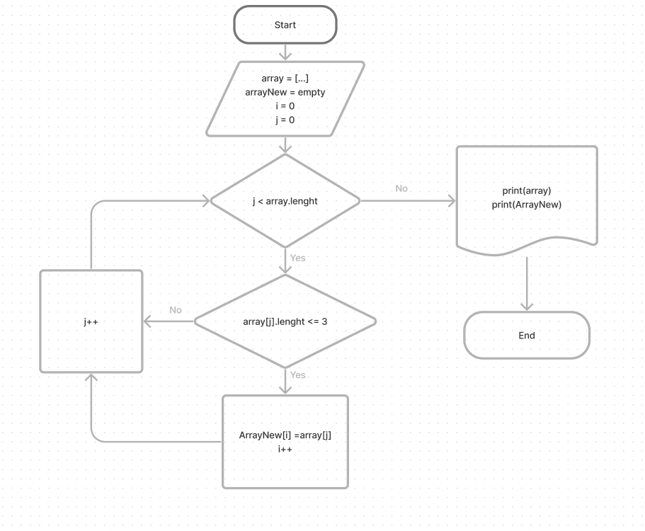

# Задача:
Написать программу, которая из имеющегося массива строк формирует новый массив из строк, длина которых меньше, либо равна 3 символам.

# Схема решения:

# Решение:

1. Инициализуруем два массива: первый содержит несколько строк разной длины, а второй является пустым и имеет такую же длину, как и первый массив.
2. Мы создаем метод для проверки длины элементов первого массива. Если длина элемента меньше или равна 3, этот элемент добавляется во второй массив.
3. Далее мы выводим на печать содержимое исходного массива, а затем содержимое второго массива.